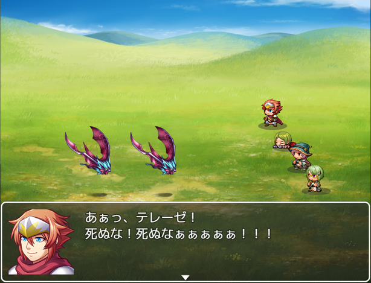

# 目次

 - [基本情報](#【基本情報】)
 - [機能](#【機能】)
 - [プラグインパラメータ](#【プラグインパラメータ】)
 - [プラグインコマンド](#【プラグインコマンド】)
 - [メモタグ](#【メモタグ】)
 - [使い方](#【使い方】)
 - [連絡先](#【連絡先】)

---
### 【基本情報】
Released under the MIT License.  
<https://opensource.org/licenses/mit-license.php>

- 作成者：げれげれ
- 作成日：01/28/2021
- 非商用利用: 自由
- 商用利用: 自由
- 再配布: OK
- 加工: OK
- 加工後の再配布: OK

利用報告は別にいらんとですよ。  
（バグ報告はいただけるとありがたいです。）

---
### 【機能】
バトル中にアクターのHPが０になった際、指定したスイッチをオンにするだけの
シンプルな機能のプラグインです。
また、その際に該当アクターのアクターIDをゲーム変数に格納します。
（※全体攻撃などで複数のアクターが同時に倒れた場合は
一番最後に倒れたアクターのアクターIDのみを格納します）

プラグインとしてはスイッチをオンにするだけですが、そのスイッチに対応する
バトルイベントを用意することで様々な機能を再現できるでしょう。  
  
（一例：アクターの一人のＨＰが０になった際に、バトルイベントによって該当アクターの名前を叫ばせている。  
他、イベントの組み方次第で複雑多彩な効果を生み出せます。）

この機能は戦闘中のみ有効です。
マップシーンでのスリップダメージや床ダメージ、イベントコマンドによるHP増減などで
HP０となっても反応しません。
MV/MZ共用です。

---
### 【プラグインパラメータ】
 - [param switchId]  
操作したいスイッチのID  

 - [param variableId]  
ＨＰが０になったアクターのアクターIDを格納するゲーム変数ID

### 【プラグインコマンド】
### 【メモタグ】
ありません。

---
### 【使い方】  
プラグイン管理に登録し、プラグインパラメータからスイッチと変数のＩＤを指定してください。
スイッチオン後の具体的な挙動はバトルイベント側で設定します。

---
### 連絡先
Twitter: <https://twitter.com/geregeregere>  
GitHub: <https://github.com/gere-gere>